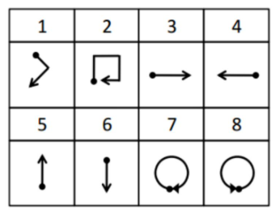

<style>
#TOC {
  color: #708090;
  font-family: Calibri;
  font-size: 16px;
  border-color: #708090;
  }
  body {
    color: #708090;
    font-family: Calibri;
    background-color: #F5F5F5;
  }
  pre {
    color: #708090;
    background-color: #F8F8F8;
  }
  </style>

```{r setup, include=FALSE}
knitr::opts_chunk$set(echo = TRUE, fig.align = "center", message = FALSE, warning = FALSE, error = FALSE)
```


# GESTURE RECOGNITION

## 1. INTRODUCTION

According to Liu et al. (2009) recently Gestures recognition has become popular and has been extensively investigated. However, there are multiple technical challenges to gesture-based interaction. The aim is to provide efficient personalized gesture recognition on wide range of devices.

1.	Unlike many pattern recognition problems, gesture recognition lacks a standardized
or widely accepted “vocabulary”. It is often necessary for users to create their own gestures. And with personalized gestures, it is difficult to collect a large set of training samples necessary for established statistical methods.

2.	Spontaneous interaction requires immediate engagement therefore the overhead of setting up the recognition instrumentation should be minimal. As a result, computer vision or glove based solutions are unsuitable.

3.	The targeted platforms for personalized gesture recognition are usually highly constrained in cost and system resources, including battery, computing power.

The method only requires a single training sample to start and only employs a three-axis accelerometer that has already appeared in numerous consumer electronics. Liu et al. (2009) matches the accelerometer readings for an unknown gesture with those for a vocabulary of known gestures. The method evaluates a gesture library with over 4000 samples collected from eight users over an elongated period of time for a gesture vocabulary with eight gesture patterns identified by a Nokia research. These gestures are given in the figure below.



### 1.1 Data

The library,data consists of 4000 instances which has the accelerometer readings in three dimensions (i.e. x, y and z).  All rows are an instance. First column is the class of the gesture as showen in the figure above. The columns from second to last are the time ordered observations in the corresponding axis. There are 3 files that are related to X, Y and Z axes.

### 1.2 Objective

In this assignment, we want to apply principle component analysis (PCA) to be able to describe the 3D information in 1D. Also, we try to reduce the dimension of the time order from 315 to 2. So, we can use much more less column to describe the gesture of the user.


```{r packages, message=FALSE, warning=FALSE}
#Required packages
pti <- c("data.table", "tidyverse", "plotly", "ggplot2")
pti <- pti[!(pti %in% installed.packages())]
if(length(pti)>0){
    install.packages(pti)
}

library(data.table)
library(tidyverse)
library(plotly)
```

Before starting the data manipulation we load _data.table_, _tidyverse_ and _plotly_ packages and import the data.Then by using the function *prepare_data*, we import the data and rename the columns. 
However the data provided is a regular data matrix each row represents an instance and columns represent the time index of the observations. On the other hand, our example is a multivariate time series where we have X, Y and Z variables. As our aim is to reduce this multivariate time series to a univariate one with a dimensionality reduction approach. And one way to achieve this task is to transform your data into the long format. The function, *transform_long*, is used to transform the wide data into long data, which is called melting the data. With following steps, we imported the data, created a wide and long format of the data and we are ready to do our analysis.


```{r functions}
prepare_data = function(from, ax){
  data = fread(from)
  columns = c("class", paste(paste(ax, 'T', sep = ''), 1:(ncol(data)-1), sep = ''))
  colnames(data) = columns
  data
}

transform_long = function(data, ax){
  data = data[, "time series" := 1:nrow(data)]
  data_long = gather(data, "time index", val, paste(ax, 'T1', sep = ''):paste(ax, 'T315', sep = ''))
  colnames(data_long)[4] = ax
  data_long[,3] = unlist(lapply(data_long[,3], function(x){as.numeric(substring(x, 3, length(x) + 4))}))
  data_long = data_long[order(data_long[,2], data_long[,3]),]
  as.data.table(data_long)
}


pca_plot = function(value){
  series = unlist(unique(x_train_long[class == value, 2]))
  set.seed(1295)
  randoms = sample(series, 2)
  
  plot_data = data_long[`time series` %in% randoms,]
  plot_data[,1] = apply(plot_data[,1], 2, as.character)
  ggplot(plot_data, aes(x = `time index`, y = PCA1, color = `time series`)) +
    geom_point() +
    theme_classic()+
  labs(title = paste("1D Plot For Class", value, sep = ' '),
       x = "Time Index",
       y = "First Component")
}

pca_class = function(value){
  data = data_long[data_long$class == value,]
  pca = princomp(data[, 3:5], cor = T)
  summary(pca, loadings=T)
}
```


```{r data from local, include=FALSE}
x_train = prepare_data("uWaveGestureLibrary_X_TRAIN", 'X')
y_train = prepare_data("uWaveGestureLibrary_Y_TRAIN", 'Y')
z_train = prepare_data("uWaveGestureLibrary_Z_TRAIN", 'Z')

data_wide = cbind(x_train, y_train[, 2:ncol(y_train)], z_train[, 2:ncol(z_train)])

x_train_long = transform_long(x_train, 'X')
y_train_long = transform_long(y_train, 'Y')
z_train_long = transform_long(z_train, 'Z')

data_long = x_train_long %>%
  left_join(y_train_long, by = c("time series", "time index", "class")) %>%
  left_join(z_train_long, by = c("time series", "time index", "class"))

data_long = data_long[, c(2, 3, 4, 5, 6, 1)]

head(x_train)
head(y_train)
head(z_train)
head(data_wide)
head(x_train_long)
head(y_train_long)
head(z_train_long)
head(data_long)
```

## Part a: 3D Scatter Plot

An accelerometer is an electromechanical device used to measure acceleration forces. Therefore, the data given in the data set are stored as acceleration values. Acceleration is the change in velocity (Δv) over the change in time (Δt). These acceleration values are summed up cumulatively to get the velocity values. However, the gesture types defined in the Figure are in 2D and they can be best described by length. Therefore, a 3D scatter plot created with distance data would be more describing to relate to the shape of gestures shown in the Figure. For this reason, position values need to be calculated in order to associate these gesture types with data. The velocity values are added up cumulatively again to obtain the position values. These position values obtained for three axes are for 8 gesture types are calculated with the second function. The, *position*, function is used to calculate the position information from accelerometer information, which taking the cumulative summation of the cumulative summation of accelerometer. Fourth function, *pca_plot*, is used to plot the first component of the PCA result. In the plot, we randomly pick 2 instances of the class. The fifth function, *pca_class*, is used to apply PCA to each class separately.

To be able to plot the data in 3D we used the _plotly_ package and position information.

```{r 3D scatter}

position = function(data, ax){
  x = data[data[, .I[1], by = class]$V1][, -1]
  y = t(x)
  y = y[,order(data[data[, .I[1], by = class]$V1][, class])]
  y = cbind(y, apply(y, 2, cumsum))
  y = cbind(y, apply(y[,9:16], 2, cumsum))
  colnames(y) = c(paste(ax, 1:8, sep = "_"), paste("vel", 1:8, sep = "_"), paste("position", 1:8, sep = "_"))
  y
}

x_position = position(x_train, 'X')
y_position = position(y_train, 'Y')
z_position = position(z_train, 'Z')


plot_ly(x = x_position[,"position_1"], y = y_position[,"position_1"], z = z_position[,"position_1"], type="scatter3d", mode="markers") %>%
  layout(title = "3D Plot of Position for Class 1")
plot_ly(x = x_position[,"position_2"], y = y_position[,"position_2"], z = z_position[,"position_2"], type="scatter3d", mode="markers") %>%
  layout(title = "3D Plot of Position for Class 2")
plot_ly(x = x_position[,"position_3"], y = y_position[,"position_3"], z = z_position[,"position_3"], type="scatter3d", mode="markers") %>%
  layout(title = "3D Plot of Position for Class 3")
plot_ly(x = x_position[,"position_4"], y = y_position[,"position_4"], z = z_position[,"position_4"], type="scatter3d", mode="markers") %>%
  layout(title = "3D Plot of Position for Class 4")
plot_ly(x = x_position[,"position_5"], y = y_position[,"position_5"], z = z_position[,"position_5"], type="scatter3d", mode="markers") %>%
  layout(title = "3D Plotn of Position for Class 5")
plot_ly(x = x_position[,"position_6"], y = y_position[,"position_6"], z = z_position[,"position_6"], type="scatter3d", mode="markers") %>%
  layout(title = "3D Plot of Position for Class 6")
plot_ly(x = x_position[,"position_7"], y = y_position[,"position_7"], z = z_position[,"position_7"], type="scatter3d", mode="markers") %>%
  layout(title = "3D Plot of Position for Class 7")
plot_ly(x = x_position[,"position_8"], y = y_position[,"position_8"], z = z_position[,"position_8"], type="scatter3d", mode="markers") %>%
  layout(title = "3D Plot of Position for Class 8")
```

We can relate these graphs to the gestures in the Figure. When the 3D shapes are arranged projected to 2D we can see the similarity.


## Part b: Dimensionality reduction from 3D to 1D

The premise of the method used by Liu et al. (2009) was that that human gestures can be characterized by the time series of forces applied to the handheld device. Therefore, they proposed a device that bases the recognition on the matching of two time series of forces, measured by a single three-axis accelerometer. As proposed method matches the accelerometer readings for an unknown gesture with those for a vocabulary of known gestures I also used the acceloration data in order to match with gestures.

In order to apply PCA we have to consider the following things:
1. We need to have a multivariate normal assumption.
2. We need to have a linearity assumption for the covariances.
3. We need to make sure that the features are on same scale. If they are not we should standardize.
check the scales and makes


```{r}
head(apply(x_train[,-1], 1, mean))
head(apply(x_train[,-1], 1, sd))
head(apply(y_train[,-1], 1, mean))
head(apply(y_train[,-1], 1, sd))
head(apply(z_train[,-1], 1, mean))
head(apply(z_train[,-1], 1, sd))
```

When we look at the mean and standard deviation of all data, they all have zero mean and 1 standard deviation. The features are on same scale and we can proceed with the PCA.

```{r}
pca = princomp(data_long[,3:5], cor = T)
summary(pca, loadings=T)

data_long[, PCA1 := pca$scores[,1]]
```

When we observe the summary output, we can see that with one principal component we can explain arround 50% of the data.

Then, we can plot them with time index information. Recall that previous 3D scatter plots were obtained by using position data. However we applied PCA on the acceleration. Therefore to be able to compare them we need to use the 3D scatter plot of the acceleration. 

```{r}
pca_plot(1)
plot_ly(x = x_position[,"X_1"], y = y_position[,"Y_1"], z = z_position[,"Z_1"], type="scatter3d", mode="markers")%>%
  layout(title = "3D Plot of Accelation for Class 1")

```


```{r}
pca_plot(2)
plot_ly(x = x_position[,"X_2"], y = y_position[,"Y_2"], z = z_position[,"Z_2"], type="scatter3d", mode="markers")%>%
  layout(title = "3D Plot of Accelation for Class 2")

```


```{r}
pca_plot(3)
plot_ly(x = x_position[,"X_3"], y = y_position[,"Y_3"], z = z_position[,"Z_3"], type="scatter3d", mode="markers")%>%
  layout(title = "3D Plot of Accelation for Class 3")
```


```{r}
pca_plot(4)
plot_ly(x = x_position[,"X_4"], y = y_position[,"Y_4"], z = z_position[,"Z_4"], type="scatter3d", mode="markers")%>%
  layout(title = "3D Plot of Accelation for Class 4")
```


```{r}
pca_plot(5)
plot_ly(x = x_position[,"X_5"], y = y_position[,"Y_5"], z = z_position[,"Z_5"], type="scatter3d", mode="markers")%>%
  layout(title = "3D Plot of Accelation for Class 5")
```


```{r}
pca_plot(6)
plot_ly(x = x_position[,"X_6"], y = y_position[,"Y_6"], z = z_position[,"Z_6"], type="scatter3d", mode="markers")%>%
  layout(title = "3D Plot of Accelation for Class 6")
```


```{r}
pca_plot(7)
plot_ly(x = x_position[,"X_7"], y = y_position[,"Y_7"], z = z_position[,"Z_7"], type="scatter3d", mode="markers")%>%
  layout(title = "3D Plot of Accelation for Class 7")
```


```{r}
pca_plot(8)
plot_ly(x = x_position[,"X_8"], y = y_position[,"Y_8"], z = z_position[,"Z_8"], type="scatter3d", mode="markers")%>%
  layout(title = "3D Plot of Accelation for Class 8")
```

When we compare 1D and 3D plots of acceleration plots it is not very easy to see similarities.  This is not very surprising as in the summary of the PCA, one component can only explain the half of the data. So, we lose some information in this process.

On the other hand, among classes we can see clearly similarity between selected two samples. By using these similarities it may be possible to separate classes in the reduced dimensions. Furthermore, unlike speech recognition, gesture recognition has more flexible inputs, because the user can compose gestures without the constraint of a “language”. Due to a lack of a standardized gesture vocabulary, human users may have diverse opinions on what constitutes a unique gesture. The premise of this application was that human gestures can be characterized as time series of forces applied to a handheld device. However, the users exhibit high variations in the same gesture over the time. Samples for the same gesture from the same day cannot capture this and may lead to overly optimistic recognition results. So we can conclude that similarities in two samples among each lass is strong enough to separate classes in the reduced dimension. 


## Part c: Applyin PCA seperatly to the classes

Another approach would be to apply the PCA process for every class individually. We can expect to get better result with this approach, because we can reduce the variance among the classes. 

```{r}
pca_class(1)  
```

When we look at the summary, we see that 46% of the data can be explained with one component. It is worse than the general PCA result if we want to explain the class 1.

```{r}
pca_class(2)  
```

When we look at the summary, we see that 51% of the data can be explained with one component. It is better than the general PCA result if we want to explain the class 2.

```{r}
pca_class(3)  
```

When we look at the summary, we see that 54% of the data can be explained with one component. It is better than the general PCA result if we want to explain the class 3.

```{r}
pca_class(4)  
```

When we look at the summary, we see that 55% of the data can be explained with one component. It is better than the general PCA result if we want to explain the class 4.

```{r}
pca_class(5)  
```

When we look at the summary, we see that 65% of the data can be explained with one component. It is better than the general PCA result if we want to explain the class 5.

```{r}
pca_class(6)  
```

When we look at the summary, we see that 57% of the data can be explained with one component. It is better than the general PCA result if we want to explain the class 6.

```{r}
pca_class(7)  
```

When we look at the summary, we see that 52% of the data can be explained with one component. It is better than the general PCA result if we want to explain the class 7.

```{r}
pca_class(8) 
```

When we look at the summary, we see that 61% of the data can be explained with one component. It is better than the general PCA result if we want to explain the class 8.

In general, we can say that applying PCA for every class gives better result than applying to all class. This approach is applicable for this data, because we have only eight class. If we have many more class than eight, it would be more time consuming process.

## Part d: Multi Dimensional Scaling (MDS)

In this part our objective is to visualize the time series in reduced dimensions for classification purposes. And we are expected to obtain a symmetric distance matrix. 

When we look at the data, we can see that there are 315 time ordered information. This is a large number to consider as feature in a model. Therefore decreasing the number of features can be a good approach. For this purpose we can use multi-dimensional scaling (MDS) approach. Before this approach, we need to calculate distance matrix of the data. We can compute the distance between the time series for each axis using the original representation  over each axis and sum them up to obtain a final distance measure. We can get distance matrix with *dist* function. _manhattan_ distance method is used. Because we need to sum all distances of axes and with Manhattan distance this operation will be more meaningful. 

```{r}
x_train_distance = as.matrix(dist(x_train[, 2:316], method = 'manhattan'))
y_train_distance = as.matrix(dist(y_train[, 2:316], method = 'manhattan'))
z_train_distance = as.matrix(dist(z_train[, 2:316], method = 'manhattan'))

data_distance = x_train_distance + y_train_distance + z_train_distance
```

After preparing the distance matrix, we can apply the MDS and plot the result in 2D with respect to classes.

```{r}
mds = cmdscale(data_distance, k=2)
mds = data.table(unlist(apply(x_train[, 1], 2, as.character)), D1 = mds[,1], D2 = mds[,2])

mds_plot <- ggplot(mds, aes(x = D1, y = D2, color = class)) +
  geom_point() +
  labs(title = "Plot for the MDS Method",
       x = "First Dimension",
       y = "Second Dimension")

mds_plot

mds_plot + facet_wrap(~class)
```

When we visualize the time series in reduced dimension we expect:
1. To obtain a symmetric distance matrix. 
2. For classification purposes the same gesture types must be close to each other. 

We can see that the Plot for the MDS Method fits to both of these objectives.

Firstly, according to plots obtained as a result of MDS, classes 1, 2 and 7 are very closely grouped together, while other data points spread in a wider area. Nonetheless, we can see that classes are some what grouped. This means that when the dimension is reduced, the remaining information necessary for this task is kept .

Secondly, recall in the defined gestures classes 3-4,5-6 and 7-8 are exactly opposite of each other. Therefore I would expect to see some what a relationship among these classes even after dimension is reduced. And we see these relationships with symmetry.


When we look at the plot we can see that:
For classes 3 and 4, instances are symmetric to each other by a x=-y line 
For classes 5 and 6, instances are symmetric to each other by a x=0 line
For classes 7 and 8, instances are symmetric to each other by a x=y line

We can conclude that this MDS is a successful methods after dimensionality reduction, the remaining information that is necessary for classification is kept in the data.


## Conclusion

In this application I saw that it is not very easy to classify gesture classes based on acceleration data. Liu et al (2009) explains some of the reasons that may result with this complexity. Unlike speech recognition, gesture recognition has more flexible inputs, because the user can compose gestures without the constraint of a language. Due to a lack of a standardized gesture vocabulary, human users may have diverse opinions on what constitutes a unique gesture. Therefore, the users exhibit high variations in the same gesture over the time. More complicated gestures may lead to higher accuracy because they are likely to have more features that distinguish them from each other. Nevertheless, complicated gestures pose a burden to human users: the user has to remember how to perform complicated gestures in a consistent manner and associate them with some unrelated functionality.As Liu et al (2009) highlights that the main goal for this application was not to find the best method to classify gestures.

*”Our objective is not to explore the most effective adaptation methods but to demonstrate the
template adaptation can be easily implemented and effective in improving recognition accuracy over multiple days”*

As explained in the begin Other gesture recognition methods such as computer vision techniques and statistical methods have some downsides as well. It is difficult to collect a large set of training samples necessary for established statistical methods.  Spontaneous interaction requires immediate engagement therefore the overhead of setting up computer vision are not always unsuitable.On the other hand, the method Liu et al. (2009) only requires a single training sample to start and only employs a three-axis accelerometer that has already appeared in numerous consumer electronics. And is good enough to somehow classify the gesture classes. 

For the required task, the method to be used can be optimized by considering these advantages and disadvantages.

## Reference
J. Liu, Z. Wang, L. Zhong, J. Wickramasuriya, and V. Vasudevan. uWave: Accelerometer-based personalized gesture recognition and its applications. Pervasive Computing and Communications, IEEE International Conference on, 0:1-9, 2009.