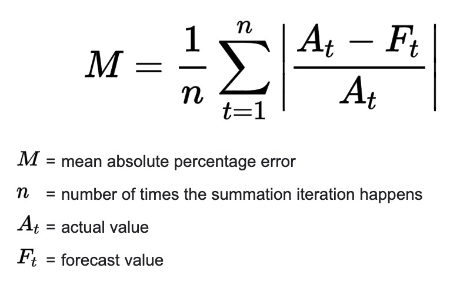
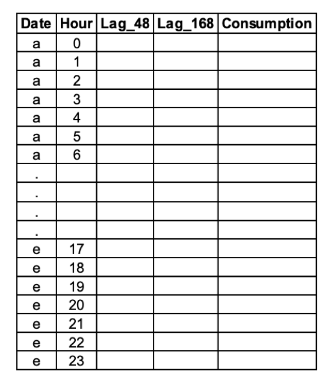
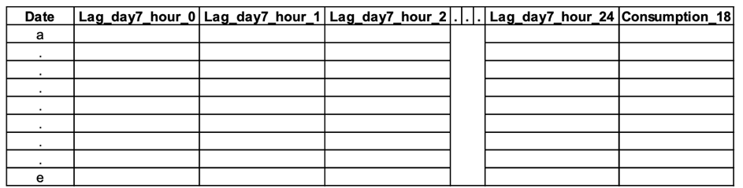

```{r setup, include=FALSE}
knitr::opts_chunk$set(echo = TRUE, fig.align = "center", message = FALSE, warning = FALSE, error = FALSE)
```


<style>
#TOC {
  color: #708090;
  font-family: Calibri;
  font-size: 16px;
  border-color: #708090;
  }
  body {
    color: #383838;
    font-family: Calibri;
    background-color: #F5F5F5;
  }
  pre {
    color: #708090;
    background-color: #F8F8F8;
  }
  h1.title {
  color: #800000
  }
  h4.author {
  color: #800000
  }
  h4.date {
  color: #800000
  }
  </style>

# PENALIZED REGRESSION TO FORCAST ELECTRIC CONSUMPTION IN TURKEY

## 1. INTRODUCTION

In this assignment, we want to forecast the hourly electricity consumption(MWh) of Turkey for the next day. The consumption series are made publicly available by [EPİAŞ](https://seffaflik.epias.com.tr/transparency/tuketim/gerceklesen-tuketim/gercek-zamanli-tuketim.xhtml). For this report data electricity consumption between 1st of January, 2016 and 1st of December, 2020 dates will be used. The data  between 1st of January, 2016 and 1st of November, 2020 will be used to train models. And the data between 1st of November, 2020 and 1st of December, 2020 will be used as test data. And mean absolute percentage error (MAPE) will be used as performance metric.

## 2. PREPARING THE DATA

### 2.1 Packages

To begin analyzing  _data.table_, _tidyverse_, _lubridate_, _caret_ and _glmnet_ packages are loaded.


```{r packages, message=FALSE, warning=FALSE}

library(data.table)
library(tidyverse)
library(lubridate)
library(glmnet)
library(caret)

```


### 2.2 Cleaning the Data

Then we import the data and change the column names.

```{r data from local}
electricity = fread("~/Desktop/HW3/GercekZamanliTuketim-01012016-01122020.csv")
colnames(electricity) = c('Date', 'Hour', 'Consumption')
head(electricity)
```

As we can see, the `Date` column has type *character*. To be able to perform time sries analysis we need to change the variable type to the *date* format.

```{r date change}
electricity[,DateTime := dmy_hm(paste(Date, Hour))]
electricity[,Date := dmy(Date)]
```

It is always a good idea to check the data for missing values. Firstly, we can check whether we have consumption information for all days between 1st of January, 2016 and the 1st of December, 2020.

```{r control}
days = unique(electricity$Date)
head(days)

lag_1_day = lag(days, n = 1)
sum(lag_1_day[2:length(lag_1_day)] != days[1:length(days) - 1])
days[length(days)]
```

From the result, we can say that we have electricity consumption information for all days. As there is no missing value we can proceed.

Secondly, we need to check the data to see whether we have electricity consumption information for all hours.

```{r hour control}
electricity[,Hour := hour(DateTime)]

hours = unique(electricity$Hour)
hours

lag_1_hour = lag(hours, n = 1)
sum(lag_1_hour[2:length(lag_1_hour)] != hours[1:length(hours) - 1])
hours[length(hours)]
```
There are 24 hours from0 to 23. So, we can see that we have electricity consumption information for all days. As there is no missing value we can proceed.

Then, we need to check whether we have electricity consumption information for each hour for every day.

```{r date-hour control1}
head(table(electricity$Date))
sum(table(electricity$Date) != 24)
```

There are zero instances where hour in a day is not equal to 24. So we say that for each day in our data set we have 24 hours. As there is no missing value we can proceed.

Lastly, we need to check if there are any missing hour values in the complete data set. As there are 1797 days between  1st of January, 2016 and 1st of December, 2020 we would expect to have 1797 input for each hour value.

```{r date-hour control2}
table(electricity$Hour)
```

However we can see from the table, there is a missing row for hour 3 and there is an surplus for hour 4. Earlier have checked and we know that there 24 hours for all days. So, this difference in hours occurred on the same day. We need to inspect this day further.

```{r date-hour control3}
which(table(electricity$Date, electricity$Hour==4)[,2] == 2)
```

The problem has occurred in the _2016-03-27_. 
Now we can check this day in hourly consumption detail.

```{r date-hour control4}
electricity[electricity$Date == "2016-03-27",]
```

The error found to be because of the daylight savings modification. To be able to fit model we need to have have same equal number hours in the data. We can remove this day or week completely but we rather lose as small information as possible. So, one simply way to correct this error is to change the hour from 4 to 3 on his specific day. Then, replace the `Consumption` column with zero.

```{r date-hour control5}
electricity[which(electricity$Date == '2016-03-27' & electricity$Hour == '4')[1], c("Hour", "Consumption") := list(3, "0,00")]
electricity[which(electricity$Date == '2016-03-27' & electricity$Hour == '3'), DateTime := ymd_hm(paste(Date, "03:00"))]
electricity[electricity$Date == '2016-03-27',]
```

So far we have checked the missing values regarding date and time information and cleaned the data. 

Also, we need to check our other feature consumption column. 

```{r consumption control1}
typeof(electricity$Consumption[1])
```

Consumption is stored as character. It should a numeric variable in order to perform linear regression. So, we need to convert it to numeric. 
Furthermore, when we observe the data with the `head(electricity)` command we can see that comma is used as decimal separator and period is used as a thousand separator. Therefore, we need to replace this to period for decimal separator and comma for the thousand seperator.

```{r consumption control2}

electricity$Consumption = as.numeric(str_replace(str_replace(electricity$Consumption, "\\.", "") , "\\,", "."))
```

Whit this step cleaning the data has been completed.

Lastly, a new feature can be added to identify which dates will be used for train and which dates will be used for testing.


```{r Train/Test_split}
electricity[Date < '2020-11-01', Test := 0]
electricity[Date >= '2020-11-01', Test := 1]
head(electricity)
```

### 2.3 Functions

One of the most common metrics used to measure the forecasting accuracy of a model is MAPE, which stands for mean absolute percentage error. As MAPE will be used as performance metric to be able to calculate the MAPE first we need to define _calculate_mape_ function. 

The formula to calculate MAPE is as follows:



```{r mape}
calculate_mape = function(pred, true){
  mean(abs(pred - true)/true) * 100
}
```

In some task we need to have our data in long format as represented in the figure. To do so, the  _transform_long_  function is defined.




```{r long}
 transform_long = function(data){
   long = data.table(Date = data$Date,
                     Hour = data$Hour,
                     Lag_48 = lag(data$Consumption, n = 48, default = 0),
                     Lag_168 = lag(data$Consumption, n = 168, default = 0),
                     Consumption = data$Consumption)
 }

```

In other task we need to have our data in wide format as represented in the figure. To do so, the  _transform_wide_  function is defined.



```{r wide}
transform_wide = function(data){
  lag_48 = dcast(data, Date ~ Hour, fun = mean, value.var = 'Lag_48', fill = 0)
  lag_168 = dcast(data, Date ~ Hour, fun = mean, value.var = 'Lag_168', fill = 0)
  colnames(lag_48) = c("Date", paste("Lag_day2_hour", 0:23, sep = '_'))
  colnames(lag_168) = c("Date", paste("Lag_day7_hour", 0:23, sep = '_'))
  wide = data %>%
    left_join(lag_48) %>%
    left_join(lag_168)
  wide = wide[,!c('Lag_48', 'Lag_168')]
  data.table(wide[,c(1,2,4:51,3)])
}
```

Now we can create long and wide data sets with the defined functions.

```{r data format}
electricity_long = transform_long(electricity)
head(electricity_long)
electricity_wide = transform_wide(electricity_long)
head(electricity_wide)
```


## 3. APPLICATIONS

### Task a) Naïve approaches

The naïve forecasting method dictates that we can use the previous period to forecast for the next period. It is an estimating technique in which the last period's actual data are used as this period's forecast, without adjusting them. In this task we use consumption values of 168 and 48 hours ago to predict next day’s consumption. 168 hours corresponds to 7 days wheres as 48 hour corresponds to 2 days.

MAPE values for Naïve approaches with 168 and 48 hours are calculated as it follows.

```{r naïve MAPE}
predict_lag168 = lag(electricity$Consumption, n = 168)[electricity$Test == 1]
predict_lag48 = lag(electricity$Consumption, n = 48)[electricity$Test == 1]

MAPE_lag168 = calculate_mape(pred = predict_lag168, true = electricity$Consumption[electricity$Test == 1])
MAPE_lag48 = calculate_mape(pred = predict_lag48, true = electricity$Consumption[electricity$Test == 1])

MAPE_lag168
MAPE_lag48
```

MAPE of lag 168 is `r MAPE_lag168` and MAPE of lag 48 is `r MAPE_lag48`. Lag 168 naïve approach performs better than the lag 48 naïve approach. This means that using same day of the previous week is more meaningful than using a more recent days data. So, we can interpret that there is a weekly seasonality in electricity consumptions.

Naïve forecasting is usually used only for comparison with the forecasts generated by the better (sophisticated) techniques.
As lag 168 performed better we can compare next models with the lag 168 naïve approach.

### Task b) Linear regression model

Linear regression is another popular approach that can be used for forecasting. Rather than using the consumption of seven days ago, we can create a model that uses the lag 168 and lag 48 values as input. So in this task a linear regression model that include aforementioned two features (i.e. Lag_48 and Lag_168) and an intercept is analyzed. The model is trained using the data till 1st of November, 2020 and  test is used for test to report the summary statistics and MAPE values. 
(Note that in the beginning of the time series consumption of previous days are not included in the data set. So for the rows that has NA the lag values are replaced with 0.)

```{r lr model}
model_lr = lm(Consumption ~ Lag_168 + Lag_48, data = electricity_long[electricity$Test == 0])
summary(model_lr)
plot(model_lr, which =1)
plot(model_lr, which =2)
```

When we look at the summary of the model, we can see that both lag48 and lag168 are significant. Also, F-statistic has a p-value smaller than 0.05 showing us that coefficients are significantly different than zero. Furthermore, adjusted R-squared is large meaning that around 70% of the consumption can be described by this linear relationship. Finally, estimate for Lag_168 is 5.152e-01 and estimate for Lag_48  is 3.556e-01. This means that with a unit change Lag_168 changes the objective function more than 3.556e-01. This result is parallel with our findings in the previous task. 

Although linear regression looks like a valid option for forecasting we should still keep in mind that it should satisfy linearity assumptions. And from the second plot we can see that residuals are not distributed with normal distribution. Nonetheless, we will continue to make predictions for test data and calculate MAPE. 

```{r lr MAPE}
predict_lr = predict(model_lr, newdata = electricity_long[electricity$Test == 1])
MAPE_lr = calculate_mape(pred = predict_lr, true = electricity_long$Consumption[electricity$Test == 1])
MAPE_lr
```

Recall that MAPE value for the lag 168 naïve approach was `r MAPE_lag168`. When we compare the MAPE value of linear regression model with the lag 168 naïve approach has a lower MAPE. So we can conclude that it is better to use thelag168 naïve approach than this linear regression.

### Task c) Linear regression model with hourly seasonality

Hourly seasonality is important in electric consumption. For example, can not expect electric consumption to be similar for morning and night. In the previous task although we used the same hour’s consumption value of the past days to handle this problem, we implicitly impose an assumption that prediction model for each hour has the same coefficients. Therefore, modeling
each hour separately is another way to approach to the same problem. By training linear regression models for each hour we will end up with 24 models.

```{r hourly_model}
model_lr_hourly = data.table()
for (i in 0:23){
  model_lr_hour = lm(Consumption ~ Lag_168 + Lag_48, data = electricity_long[Hour == i & electricity$Test == 0,])
  predict_lr_hour = predict(model_lr_hour, newdata = electricity_long[Hour == i & electricity$Test == 1,])
  MAPE_lr_hour = calculate_mape(predict_lr_hour, electricity_long[Hour == i & electricity$Test == 1, Consumption])
  model_lr_hourly = rbind(model_lr_hourly, data.table(Hour = i, MAPE = MAPE_lr_hour))
}
model_lr_hourly

```

Recall that MAPE value for the lag 168 naïve approach was `r MAPE_lag168`. So when we model all hours data individually, we see that there are few models that perform better than the lag 168 naïve approach. In early morning and late evening hours this approach present better MAPE values than the naive approach. This shows that there is hourly seasonality in electricity consumption.

However, for most hours MAPE for lag 168 naïve approach is lower. So, our assumption that every hour to have the same coefficient is not that problematic. If this was not the case, we would need to model each hour separately. From here we can interpret that the weekly seasonality is more important than daily seasonality. Hence,  lag 168 naïve approach is still the best performing model.

### Task d) Lasso regression

An alternative approach assuming that all hourly consumption values of last week (same day) can be important in the prediction of the next day’s consumption. This way both hourly and weekly seasonality can be introduced into the model. 
Here the 24 consumption values of the last week to predict next day’s consumption will be used. And operation requires the transformation of your data into the “wide” format which used the _transform_wide_ function.

Now we have 48 features from hourly consumption from two days ago and last week’s hourly consumption in total. We will also follow the same logic in the previous task and build a prediction model for each hour separately. Since there is a strong correlation between these predictors, we will use the penalized regression approaches for modeling. And L1 penalty will be used in the regression models for each hour. 


```{r cv.glmnet}
X = as.matrix(electricity_wide[electricity$Test == 0, !c("Consumption", "Date", "Hour")])
y = as.matrix(electricity_wide[electricity$Test == 0, "Consumption"])

lasso_cv = cv.glmnet(X, y)
lasso_cv
plot(lasso_cv)
lambda_min = lasso_cv$lambda.min
lambda_1se = lasso_cv$lambda.1se
```
In Lasso Regression, alpha is the regularization parameter. As you increase the lambda model complexity will also increase. And when model complexity increases you know that training error is also increased. There is a trade-off therefore it is important to specify lambda value. When you do random sampling one potential problem is with randomness. Because assume you do the same thing once and you obtain 10 test points. And if you would like to select lambda by trading different models with different lambda on training data and evaluate on test this going to be dependent on one possible symptom result which is not useful. One way to avoid such a problem is to replicate sampling process. We will use 10-fold cross validation to choose the best alpha value with the _train_ function.

```{r train, eval = FALSE}
set.seed(123) 
control = trainControl(method ="cv", number = 10) 
Grid = expand.grid(alpha = 1, 
                   lambda = seq(0.001, 0.1, by = 0.0001))

X1 = electricity_wide[electricity$Test == 0, 3:50]
y1 = unlist(electricity_wide[electricity$Test == 0, 51])

lasso_model = train(x = X1, 
                    y = y1,
                    method = "glmnet", 
                    trControl = control, 
                    tuneGrid = Grid 
                    ) 
lasso_model
plot(lasso_model)
```

With cross validation we have found the best alpha value for Lasso Regression, which is `r lambda_min`. And the largest value of lambda with error is still within 1 standard error of the minimum, that is equal to `r lambda_1se`. Now we will combine this with Lasso Regression and build a model for each hour of the day.

```{r lasso_hourly}
model_lasso_hourly = data.table()

for (i in 0:23){
  X_train = electricity_wide[Hour == i & Date < '2020-11-01',]
  X_train = as.matrix(X_train[,3:50])
  y_train = as.matrix(electricity_wide[Hour == i & Date < '2020-11-01', Consumption])
  X_test = electricity_wide[Hour == i & Date >= '2020-11-01',]
  X_test = as.matrix(X_test[,3:50])
  y_test = as.matrix(electricity_wide[Hour == i & Date >= '2020-11-01', Consumption])
  lasso_best_hourly = glmnet(X_train,
                             y_train,
                             alpha = 1,
                             lambda = lambda_min)
  predict_lasso_hour = predict(lasso_best_hourly, newx = X_test)
  MAPE_lasso_hour = calculate_mape(predict_lasso_hour, y_test)
  model_lasso_hourly = rbind(model_lasso_hourly, data.table(Hour = i, MAPE = MAPE_lasso_hour))
}

model_lasso_hourly

```

Recall that MAPE value for the lag 168 naïve approach was `r MAPE_lag168`. From the table we can see that Lasso regression gives MAPE results than the naïve approach.  So when we model using hourly consumption values of seven and two days ago to predict the next day’s electricity consumption we see that there are many hours that perform better than the lag 168 naïve approach. . 

When we investigate the MAPE values for Lasso regression we can see that early morning hours and late evening hours are the best performing models. Both weekly and hourly seasonality should be taken into account in order to deal with the auto-correlation between input variables. And Lasso regression tackles both problems.

Furthermore, in linear regression adding more features to the data improves training but it increases complexity and the test error increases. We Lasso regression we prevent this problem too. The results presents that using more features is necessary to explain the data. If additional variables do not contribute to the prediction performance, they will have their coefficients equal to zero.

Therefore it can be concluded that, using hourly consumption values of seven and two days ago in Lasso Regression is a better approach to predict the next day’s electricity consumption than the naive approach using Lag 168. And it is the best performing model we have found so far.

### Task e) Fused Lasso Regression (bonus)


### Task f) Comparison

Here we can plot all MAPE values in a boxplot in order to compare them.

```{r box plot}
 All_MAPE = data.table(MAPE = c(MAPE_lag168, MAPE_lag48, MAPE_lr, model_lr_hourly$MAPE, model_lasso_hourly$MAPE), Model = c('Lag_168', 'Lag_48', 'LR', rep('Hourly_LR', 24), rep('model_lasso_hourly', 24)))

ggplot(data = All_MAPE, aes(x=Model, y=MAPE)) + 
  geom_boxplot()+
  labs(x="Approaches" , y="Mape Values (%)", title="Boxplot of MAPE values for each approach")

```

When we start building models naive models are a good starting point. Then as we increase the complexity of our models we should compare them to with the result of the naive models. Because there is a trade off between complexity and bias. If a model does not perform better on testing data increasing the complexity is not a good idea. For example, Lag_168 performed better than both cumulative and hourly regression models. (Of course this may not always be the case. On the other hand we can observe that the naive approach Lag_48 has the worst prediction performance.) In linear regression adding more features to the data improves training but it increases complexity and the test error increases. With Lasso regression we prevent this problem too. If additional variables do not contribute to the prediction performance, they will have their coefficients equal to zero. Therefore we see that the Lasso regression model  is the best and is very effective. The main reason for lasso regression having the best performance is because it uses penalized approach.


## CONCLUSION

There is both weekly and hourly seasonality in our data. We saw that the weekly seasonality was stronger. However especially in early mornings and evenings hourly seasonality was also significant. So we needed a model that can handle both. But in linear regression adding more features to the data improves training yet it increases complexity and the test error increases. With penalized regression approaches we can prevent this problem and reduce the chance of overfitting.

When we have some noisy or irrelevant features in the data and then we're trying to perform linear regression we may have some problems. In general to avoid the problems with noisy or irrelevant reliable we have a topic called feature selection. Feature selection means we drop some of our variables or features in order to achieve a stable model. Recalling our complex the discussion we would like to have models with less complexity. Adding more variables that are greater or less than zero makes your model complex. One possible way to solve each selection or to solve the problems with noise irrelevant variables was stepwise regression. That works nicely but they have some problems for example if you have many of variables it takes a lot of time. 

In order to solve such issues there are penalized regression approaches are used. In penalized regression approach to formulate the regression optimization problem in a way that we provide a bound on the corporations values and sum of them. While minimizing the sum of square error we provide a budget and coefficient that can take value. In this problem you can use regularization parameter lambda . Which translates to while minimizing some of square error minimizing the coefficients that take value. So this is a convex optimization problem. We can think regularization of a model as trying to reduce complexity. Basically you defined the lambda value instead of budget which will affect model complexity.  Here a problem with lambda is that we need to define it and there’s no clear way to define it. As you increase the lambda model complexity will also increase. And when model complexity increases you know that training error is also increased. This is a trade-off. 

In order to determine lambda we will use some data out of the training data. When you do random sampling one potential problem is with randomness. Because assume you do the same thing once and you obtain 10 test points. And if you would like to select lambda by trading different models with different lambda on training data and evaluate on test this going to be dependent on one possible symptom result which is not useful. One way to avoid such a problem is to replicate sampling process. So you can replicate the sampling K times. Although there will be some overlaps between samples in terms of what you have in the test data. But still this is a valid approach.

## REFERENCES
- [EPIAS](https://seffaflik.epias.com.tr/)
- Tibshirani, R., Saunders, M., Rosset, S., Zhu, J. and Knight, K., 2005. Sparsity and smoothness via the fused lasso. Journal of the Royal Statistical Society: Series B (Statistical Methodology), 67(1), pp.91-108.


