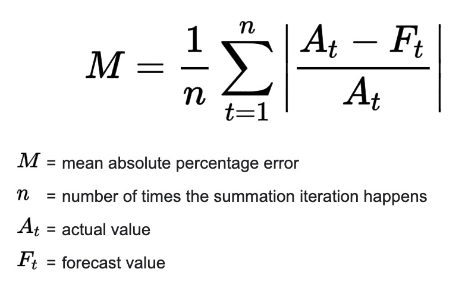
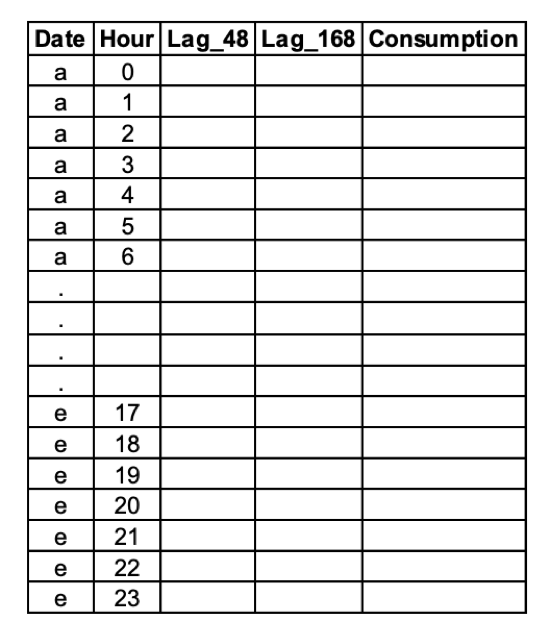
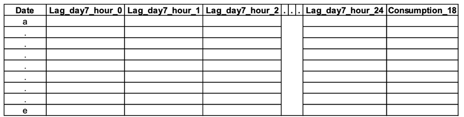

```{r setup, include=FALSE}
knitr::opts_chunk$set(echo = TRUE, fig.align = "center", message = FALSE, warning = FALSE, error = FALSE)
```


<style>
#TOC {
  color: #708090;
  font-family: Calibri;
  font-size: 16px;
  border-color: #708090;
  }
  body {
    color: #383838;
    font-family: Calibri;
    background-color: #F5F5F5;
  }
  pre {
    color: #708090;
    background-color: #F8F8F8;
  }
  h1.title {
  color: #800000
  }
  h4.author {
  color: #800000
  }
  h4.date {
  color: #800000
  }
  </style>

# PENALIZED REGRESSION TO FORCAST ELECTRIC CONSUMPTION IN TURKEY

## 1. INTRODUCTION

In this assignment, we want to forecast the hourly electricity consumption(MWh) of Turkey for the next day. The consumption series are made publicly available by [EPİAŞ](https://seffaflik.epias.com.tr/transparency/tuketim/gerceklesen-tuketim/gercek-zamanli-tuketim.xhtml). For this report data electricity consumption between 1st of January, 2016 and 1st of December, 2020 dates will be used. The data  between 1st of January, 2016 and 1st of November, 2020 will be used to train models. And the data between 1st of November, 2020 and 1st of December, 2020 will be used as test data. And mean absolute percentage error (MAPE) will be used as performance metric.

## 2. PREPARING THE DATA

### 2.1 Packages

To begin analyzing  _data.table_, _tidyverse_, _lubridate_, _caret_ and _glmnet_ packages are loaded.


```{r packages, message=FALSE, warning=FALSE}

library(data.table)
library(tidyverse)
library(lubridate)
library(glmnet)
library(caret)

```


### 2.2 Cleaning the Data

Then we import the data and change the column names.

```{r data from local}
electricity = fread("~/Desktop/HW3/GercekZamanliTuketim-01012016-01122020.csv")
colnames(electricity) = c('Date', 'Hour', 'Consumption')
head(electricity)
```

As we can see, the `Date` column has type *character*. To be able to perform time sries analysis we need to change the variable type to the *date* format.

```{r date change}
electricity[,DateTime := dmy_hm(paste(Date, Hour))]
electricity[,Date := dmy(Date)]
```

It is always a good idea to check the data for missing values. Firstly, we can check whether we have consumption information for all days between 1st of January, 2016 and the 1st of December, 2020.

```{r control}
days = unique(electricity$Date)
head(days)

lag_1_day = lag(days, n = 1)
sum(lag_1_day[2:length(lag_1_day)] != days[1:length(days) - 1])
days[length(days)]
```

From the result, we can say that we have electricity consumption information for all days. As there is no missing value we can proceed.

Secondly, we need to check the data to see whether we have electricity consumption information for all hours.

```{r hour control}
electricity[,Hour := hour(DateTime)]

hours = unique(electricity$Hour)
hours

lag_1_hour = lag(hours, n = 1)
sum(lag_1_hour[2:length(lag_1_hour)] != hours[1:length(hours) - 1])
hours[length(hours)]
```
There are 24 hours from0 to 23. So, we can see that we have electricity consumption information for all days. As there is no missing value we can proceed.

Then, we need to check whether we have electricity consumption information for each hour for every day.

```{r date-hour control1}
head(table(electricity$Date))
sum(table(electricity$Date) != 24)
```

There are zero instances where hour in a day is not equal to 24. So we say that for each day in our data set we have 24 hours. As there is no missing value we can proceed.

Lastly, we need to check if there are any missing hour values in the complete data set. As there are 1797 days between  1st of January, 2016 and 1st of December, 2020 we would expect to have 1797 input for each hour value.

```{r date-hour control2}
table(electricity$Hour)
```

However we can see from the table, there is a missing row for hour 3 and there is an surplus for hour 4. Earlier have checked and we know that there 24 hours for all days. So, this difference in hours occurred on the same day. We need to inspect this day further.

```{r date-hour control3}
which(table(electricity$Date, electricity$Hour==4)[,2] == 2)
```

The problem has occurred in the _2016-03-27_. 
Now we can check this day in hourly consumption detail.

```{r date-hour control4}
electricity[electricity$Date == "2016-03-27",]
```

The error found to be because of the daylight savings modification. To be able to fit model we need to have have same equal number hours in the data. We can remove this day or week completely but we rather lose as small information as possible. So, one simply way to correct this error is to change the hour from 4 to 3 on his specific day. Then, replace the `Consumption` column with zero.

```{r date-hour control5}
electricity[which(electricity$Date == '2016-03-27' & electricity$Hour == '4')[1], c("Hour", "Consumption") := list(3, "0,00")]
electricity[which(electricity$Date == '2016-03-27' & electricity$Hour == '3'), DateTime := ymd_hm(paste(Date, "03:00"))]
electricity[electricity$Date == '2016-03-27',]
```

So far we have checked the missing values regarding date and time information and cleaned the data. 

Also, we need to check our other feature consumption column. 

```{r consumption control1}
typeof(electricity$Consumption[1])
```

Consumption is stored as character. It should a numeric variable in order to perform linear regression. So, we need to convert it to numeric. 
Furthermore, when we observe the data with the `head(electricity)` command we can see that comma is used as decimal separator and period is used as a thousand separator. Therefore, we need to replace this to period for decimal separator and comma for the thousand seperator.

```{r consumption control2}

electricity$Consumption = as.numeric(str_replace(str_replace(electricity$Consumption, "\\.", "") , "\\,", "."))
```

Whit this step cleaning the data has been completed.

Lastly, a new feature can be added to identify which dates will be used for train and which dates will be used for testing.


```{r Train/Test_split}
electricity[Date < '2020-11-01', Test := 0]
electricity[Date >= '2020-11-01', Test := 1]
head(electricity)
```

### 2.3 Functions

One of the most common metrics used to measure the forecasting accuracy of a model is MAPE, which stands for mean absolute percentage error. As MAPE will be used as performance metric to be able to calculate the MAPE first we need to define _calculate_mape_ function. 

The formula to calculate MAPE is as follows:



```{r mape}
calculate_mape = function(pred, true){
  mean(abs(pred - true)/true) * 100
}
```

In some task we need to have our data in long format as represented in the figure. To do so, the  _transform_long_  function is defined.




```{r long}
 transform_long = function(data){
   long = data.table(Date = data$Date,
                     Hour = data$Hour,
                     Lag_48 = lag(data$Consumption, n = 48, default = 0),
                     Lag_168 = lag(data$Consumption, n = 168, default = 0),
                     Consumption = data$Consumption)
 }

```

In other task we need to have our data in wide format as represented in the figure. To do so, the  _transform_wide_  function is defined.



```{r wide}
transform_wide = function(data){
  lag_48 = dcast(data, Date ~ Hour, fun = mean, value.var = 'Lag_48', fill = 0)
  lag_168 = dcast(data, Date ~ Hour, fun = mean, value.var = 'Lag_168', fill = 0)
  colnames(lag_48) = c("Date", paste("Lag_day2_hour", 0:23, sep = '_'))
  colnames(lag_168) = c("Date", paste("Lag_day7_hour", 0:23, sep = '_'))
  wide = data %>%
    left_join(lag_48) %>%
    left_join(lag_168)
  wide = wide[,!c('Lag_48', 'Lag_168')]
  data.table(wide[,c(1,2,4:51,3)])
}
```

Now we can create long and wide data sets with the defined functions.

```{r data format}
electricity_long = transform_long(electricity)
head(electricity_long)
electricity_wide = transform_wide(electricity_long)
head(electricity_wide)
```

We are ready to accomplish the tasks.

## 3. APPLICATIONS

### Task a) Naïve approaches


When we try to forecast the electricity consumption, we can use the consumption of values of 48 and 168 hours ago. To assign the value of these numbers would be our naïve approach. Our So, our MAPE values will be like these:

```{r naïve MAPE}
predict_lag168 = lag(electricity$Consumption, n = 168)[electricity$Test == 1]
predict_lag48 = lag(electricity$Consumption, n = 48)[electricity$Test == 1]

MAPE_lag168 = calculate_mape(pred = predict_lag168, true = electricity$Consumption[electricity$Test == 1])
MAPE_lag48 = calculate_mape(pred = predict_lag48, true = electricity$Consumption[electricity$Test == 1])

MAPE_lag168
MAPE_lag48
```

MAPE of lag 168 is `r MAPE_lag168` and MAPE of lag 48 is `r MAPE_lag48`. Lag 168 naïve approach performs better than the lag 48 naïve approach. We can compare all other model with lag 168 naïve approach. With this approach, we see that weekly seasonality is more important than the two-day seasonality.

### Task b) Linear regression model

Rather than using the consumption of seven days ago, we can create a model that uses the lag 168 and lag 48 values as input. Our model can be linear regression. For the lag values of NA rows, we will impute 0.

```{r lr model}
model_lr = lm(Consumption ~ Lag_168 + Lag_48, data = electricity_long[electricity$Test == 0])
summary(model_lr)
```

When we look at the summary of the model, we see that everything seems fine to use this model. Now, we will make predictions for test data and calculate MAPE.

```{r lr MAPE}
predict_lr = predict(model_lr, newdata = electricity_long[electricity$Test == 1])
MAPE_lr = calculate_mape(pred = predict_lr, true = electricity_long$Consumption[electricity$Test == 1])
MAPE_lr
```

When we compare the MAPE value of this model with lag 168 naïve approach, it is better to use the naïve approach than this linear regression.

### Task c) Linear regression model with hourly seasonality


In the linear regression model, we didn't divide the data respect to hours. So, our approach assumes that every hour will have the same coefficient. If this is not true, we need to model each hour separately.

```{r hourly_model}
model_lr_hourly = data.table()
for (i in 0:23){
  model_lr_hour = lm(Consumption ~ Lag_168 + Lag_48, data = electricity_long[Hour == i & electricity$Test == 0,])
  predict_lr_hour = predict(model_lr_hour, newdata = electricity_long[Hour == i & electricity$Test == 1,])
  MAPE_lr_hour = calculate_mape(predict_lr_hour, electricity_long[Hour == i & electricity$Test == 1, Consumption])
  model_lr_hourly = rbind(model_lr_hourly, data.table(Hour = i, MAPE = MAPE_lr_hour))
}
model_lr_hourly
model_lr_hourly[MAPE <= MAPE_lag168,]
```

When we model all hours data individually, we see that there are `r length(model_lr_hourly[MAPE <= MAPE_lag168,])` models that are better than the naïve approach. So, we still can go further with naïve approach, which means that weekly seasonality is more important than daily seasonality.

### Task d) Lasso regression

Now, we have some linear regression models for all hour. We can go further in this step. We can create more features for a model and use a penalized regression model for creating a more generalized model. We can use all seven day ago hourly consumption values to predict the next day's consumption. With these features we can create a Lasso Regression. In Lasso Regression, alpha is an important hyper parameter. So, we can use 10-fold cross validation to choose the best alpha value.

```{r cv.glmnet}
X = as.matrix(electricity_wide[electricity$Test == 0, !c("Consumption", "Date", "Hour")])
y = as.matrix(electricity_wide[electricity$Test == 0, "Consumption"])

lasso_cv = cv.glmnet(X, y)
lasso_cv
plot(lasso_cv)
lambda_min = lasso_cv$lambda.min
lambda_1se = lasso_cv$lambda.1se
```

Also, we can use the _train_ function to perform cross validation. You can find a simple code below.

```{r train, eval = FALSE}
set.seed(123) 
control = trainControl(method ="cv", number = 10) 
Grid = expand.grid(alpha = 1, 
                   lambda = seq(0.001, 0.1, by = 0.0001))

X1 = electricity_wide[electricity$Test == 0, 3:50]
y1 = unlist(electricity_wide[electricity$Test == 0, 51])

lasso_model = train(x = X1, 
                    y = y1,
                    method = "glmnet", 
                    trControl = control, 
                    tuneGrid = Grid 
                    ) 
lasso_model
plot(lasso_model)
```

Now, we find the best alpha value for Lasso Regression, which is `r lambda_min`, and largest value of lambda such that error is within 1 standard error of the minimum, which is `r lambda_1se`. Now, we are ready to build a Lasso Regression for every hour.

```{r lasso_hourly}
model_lasso_hourly = data.table()

for (i in 0:23){
  X_train = electricity_wide[Hour == i & Date < '2020-11-01',]
  X_train = as.matrix(X_train[,3:50])
  y_train = as.matrix(electricity_wide[Hour == i & Date < '2020-11-01', Consumption])
  X_test = electricity_wide[Hour == i & Date >= '2020-11-01',]
  X_test = as.matrix(X_test[,3:50])
  y_test = as.matrix(electricity_wide[Hour == i & Date >= '2020-11-01', Consumption])
  lasso_best_hourly = glmnet(X_train,
                             y_train,
                             alpha = 1,
                             lambda = lambda_min)
  predict_lasso_hour = predict(lasso_best_hourly, newx = X_test)
  MAPE_lasso_hour = calculate_mape(predict_lasso_hour, y_test)
  model_lasso_hourly = rbind(model_lasso_hourly, data.table(Hour = i, MAPE = MAPE_lasso_hour))
}

model_lasso_hourly
model_lasso_hourly[MAPE <= MAPE_lag168,]
```

Now, we have better MAPE results than the naïve approach. So, we can conclude that using all hourly values of seven and two days ago in Lasso Regression is a better approach to forecast the next day's consumption than naïve approach.

### Task e) Fused Lasso Regression (bonus)


### Task f) Comparison

Now, at the end of the task, we can plot all MAPE values in a boxplot.

```{r box plot}
All_MAPE = data.table(MAPE = c(MAPE_lag168, MAPE_lag48, MAPE_lr, model_lr_hourly$MAPE, model_lasso_hourly$MAPE), Model = c('lag 168 naïve approach', 'lag 48 naïve approach', 'LR', paste(0:23, 'Hour_LR', sep = '_'), paste(0:23, 'Hour_Lasso', sep = '_')))
ggplot(aes(y = MAPE), data = All_MAPE) +
  geom_boxplot()
```

When we look at the results of all MAPE values, we see that almost half of the MAPE values are between 4 and 5. Most of these values are around 4. So, we can say that, if a model whose MAPE value is more than 5, it can be thought as an inefficient model respect to others. 

```{r MAPE}
head(setorder(All_MAPE, MAPE))
```

When we look at the top MAPE values, they belong to  `r setorder(All_MAPE, MAPE)[1,2]`.

## REFERENCES
- [EPIAS](https://seffaflik.epias.com.tr/)
- [MAPE](https://www.statology.org/mape-r/)


